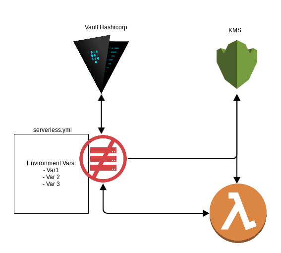

# serverless-vault-plugin
======
[](https://circleci.com/gh/Rondineli/serverless-vault-plugin/tree/master)


## Why to use it?
Vault is an amazing tool to use to store secrets, I have been using it for a while. Since I've started to use lambda + serverless I have been looking for something that could allow me deploying it in a safe way, not writing files or commit my passwords on github to be able using a continuous deployment, so I decided to write my own plugin to solve my problem.

## Why not SSM?
I have been using vault as my store secret and it's been working well since then I have managed to keep using it to any apps based on app authentication or keys trought my vault api. When we decided move to lambda we didn't want to move anything else to aws (I know we are lock-in), but then we decided to keep vault as our secret manager.

## Why KMS then?
Well, altho we are using vault, once I am retrieving it I need to handle it as a plain text, which is not good as well. So, I just store my secrets there and release it encrypted on kms to lambda and my app will be able see it encrypted.

## Topology


## How to use it?
### Add those configgs in your `serverless.yml`
```
custom:
  config: ${file(env/${opt:stage}.yml)}

  vault:
    token: "<app token>"
    url: "https://vault:8200"
    secret: "secret/path"
    ssl_check: false
  kms:
    keyId: ${env:KEY_KMS_ID}
```

### That's all you need, and then, add your env var as a list, like:
```
environment:
  - VAR_FOO
  - VAR_BAR
```

After that, once you run `sls deploy -s <stage>` it will fetch from your secret path and try to find `VAR_FOOR`, `VAR_BAR` from vault, encrypt it on kms and insert on environment object on your deployment runtime.
